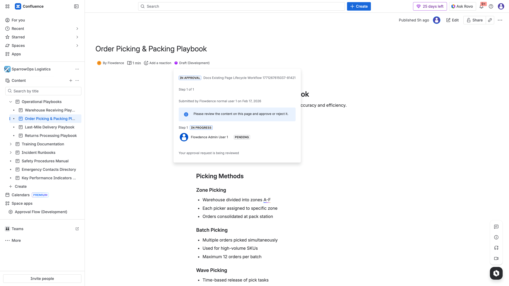
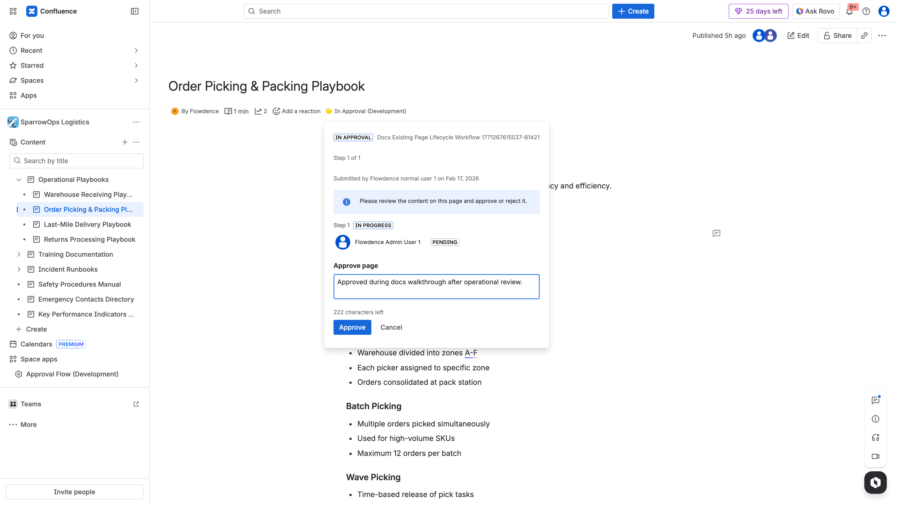
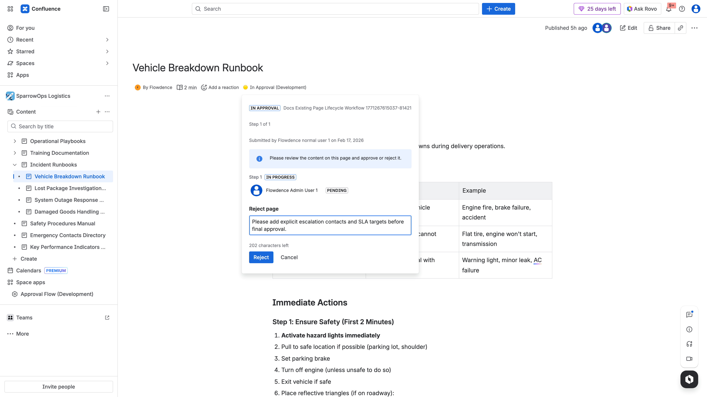
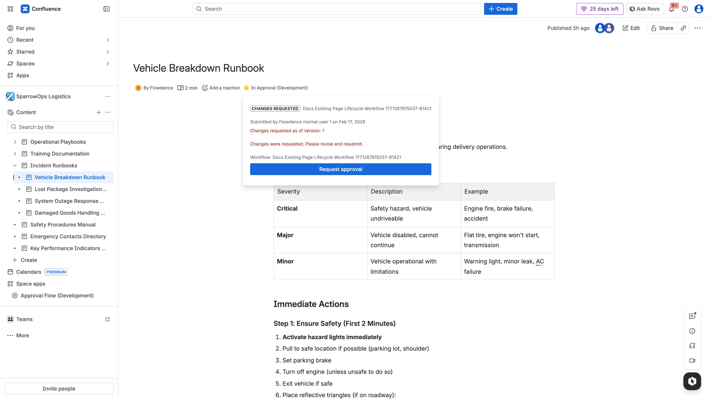

## Purpose

The page byline is where authors and approvers interact with approval lifecycle state.

## Author Flow

1. Open an existing Confluence page.
2. Open byline status (`Draft`, `In Approval`, etc.).
3. Select workflow.
4. Click `Request approval` (if available).
5. Confirm status changes to `In Approval`.

## Approver Flow

1. Open the same page as approver.
2. Open byline panel.
3. Click `Approve` or `Reject`.
4. Add decision comment.

## Status Outcomes

- Approved state:

- Rejected/changes requested state:

