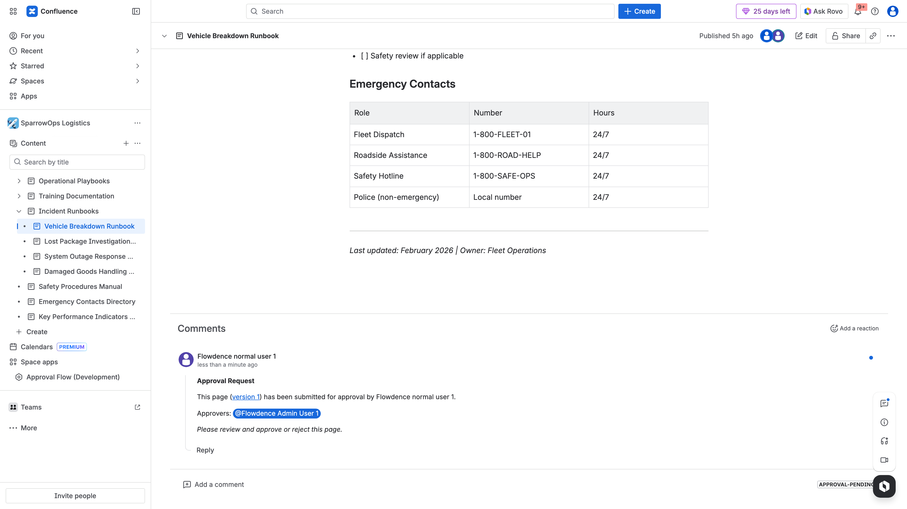
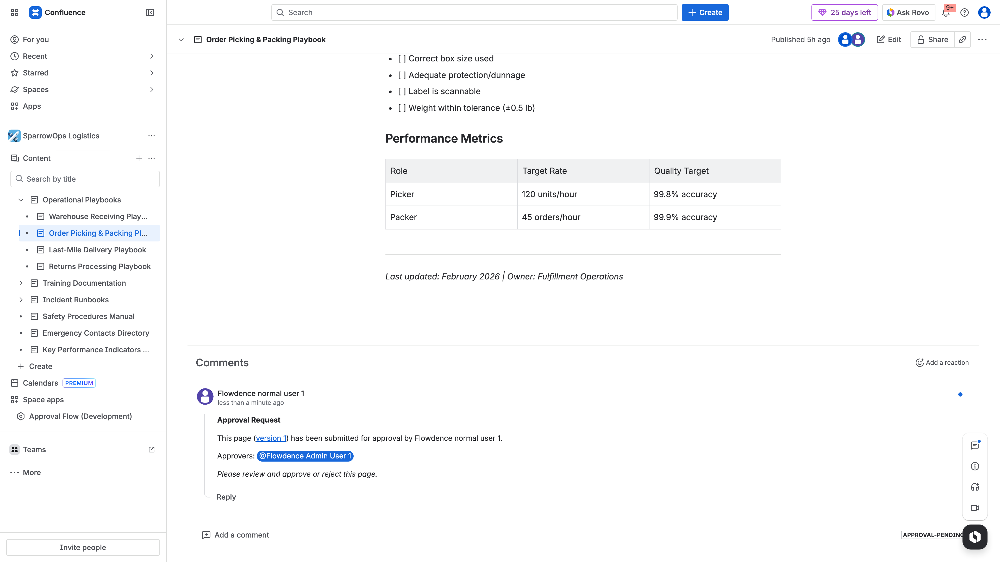

## Purpose

Approval Flow writes lifecycle comments into the page comments section so activity is visible and auditable.

## Key Behaviors

- `Approval Request` comment posted when author submits.
- Decision comments can include approver rationale.
- Comments remain attached to page history.

## Evidence

### Approval Request Comment

### Additional Comment Thread View

## Operational Use

Use comments to:

- Confirm who submitted and when.
- Confirm approver(s) involved.
- Retain rationale for approvals/rejections.
