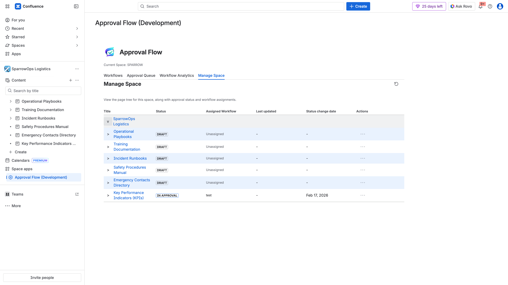

## Purpose

`Manage Space` shows the page tree with approval status and assigned workflow per row.

## What You Can See

- Space hierarchy.
- Current approval status tags (`Draft`, `In Approval`, etc.).
- Assigned workflow.
- Status change date.
- Row actions column (`...`) for assignment/approval operations when available.

## Standard Operator Actions

1. Expand tree nodes to locate target page.
2. Confirm status and assigned workflow.
3. Use row actions (`...`) where available for:
   - Change workflow assignment.
   - Reset approval state.

## Notes

- Row action availability depends on page status, assignment state, and current user permissions.
- Use `Approval Queue` and page comments with this view for complete operational context.
