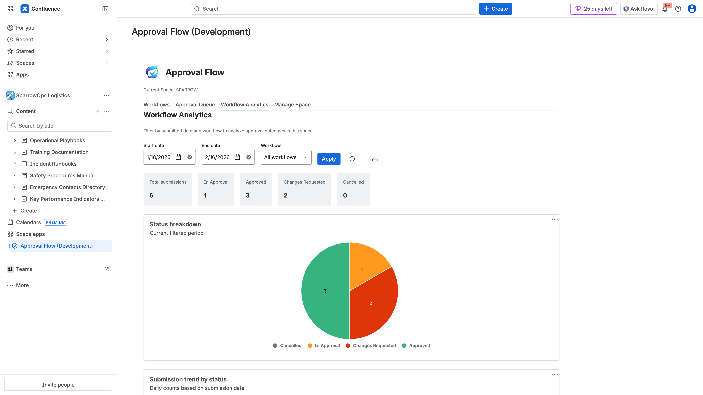

## Purpose

`Workflow Analytics` summarizes approval performance across a selected time period and workflow filter.

## What You Can Analyze

- Total submissions.
- In Approval count.
- Approved count.
- Changes Requested count.
- Cancelled count.
- Status distribution chart.

## Usage Pattern

1. Set start/end date.
2. Filter by workflow (or all workflows).
3. Click `Apply`.
4. Use cards/charts for reporting and operational review.
