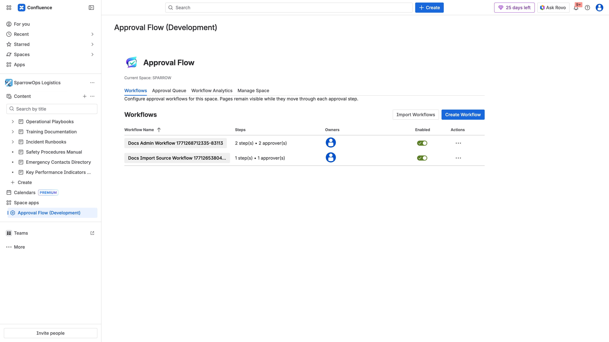
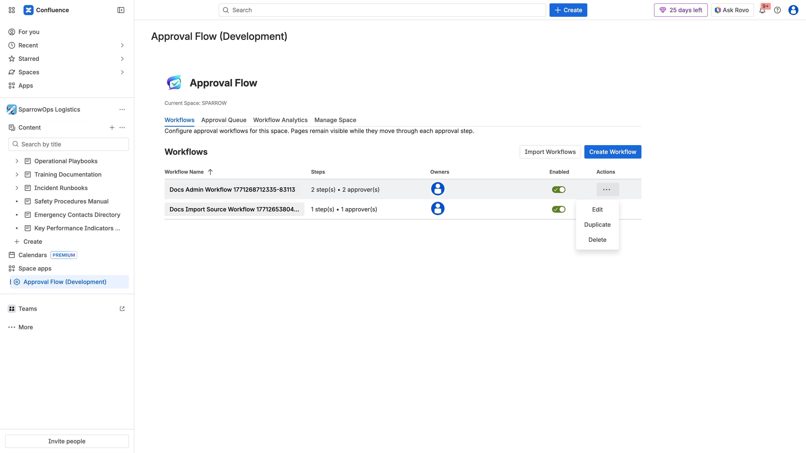
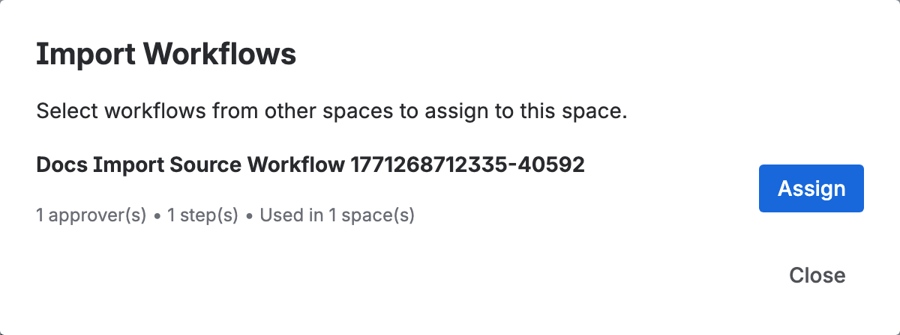
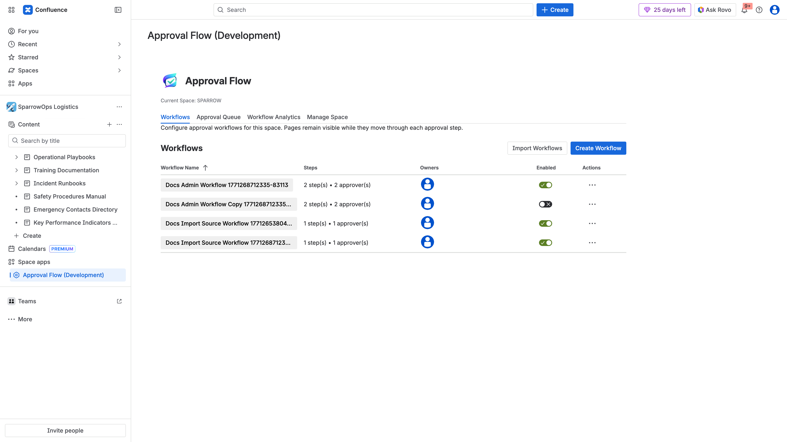

## Purpose

`Workflows` is the control center for approval logic per space.

## What You Can Do Here

- Create workflow.
- Edit workflow.
- Duplicate workflow.
- Enable/disable workflow.
- Import workflows from other spaces.

## Step-by-Step

1. Open `Approval Flow (Development)` in your space.
2. Stay on `Workflows` tab.
3. Create workflow and assign approvers.
4. Open row actions (`...`) for edit/duplicate/delete operations.
5. Use toggle in `Enabled` column for activation control.

## Cross-Space Import

1. Click `Import Workflows`.
2. Select source workflow from another space.
3. Click `Assign`.
4. Validate imported row appears in table.

## Video

- [Admin workflow walkthrough](../../assets/videos/admin-workflow-management/admin-workflow-management-walkthrough.webm)
