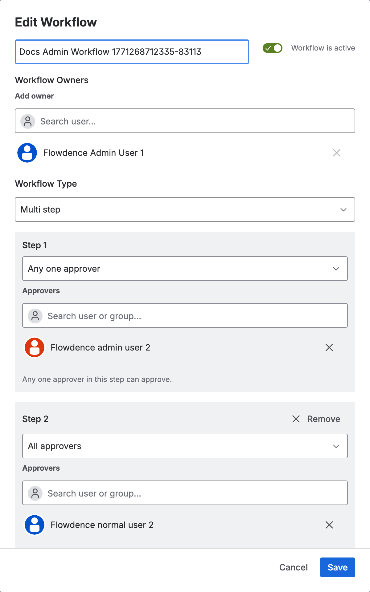
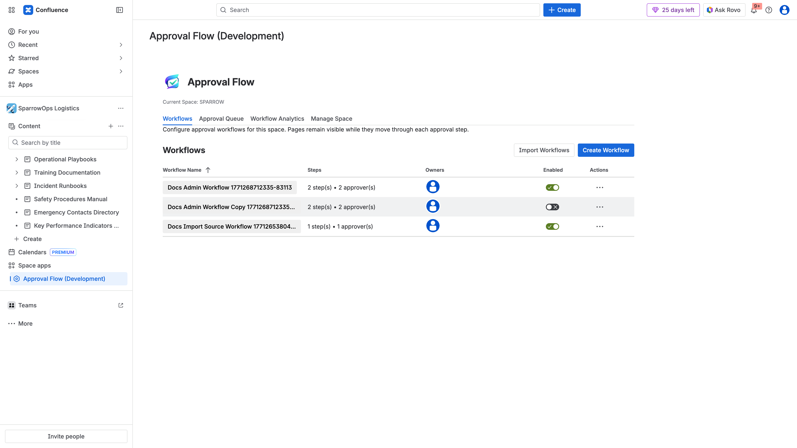

## Configuration Goals

Initial production-ready configuration includes:

- At least one active workflow.
- Valid approver assignment.
- Workflow naming convention.
- Optional cross-space import source strategy.

## Step 1: Open Workflows Tab

## Step 2: Create Main Workflow

1. Click `Create Workflow`.
2. Enter workflow name with clear purpose (example: docs lifecycle).
3. Select workflow type:
   - `Single step` for simple approval.
   - `Multi step` for sequential approvals.
4. Add approver(s).
5. Set approval mode (`Any one approver` or `All approvers`).
6. Save.

## Step 3: Edit Workflow Details

- Use row actions (`...`) -> `Edit`.
- Update owners/approvers/step behavior.

## Step 4: Manage Lifecycle Operations

- Duplicate workflow for safe experimentation.
- Disable a workflow when pausing usage.

## Step 5: Cross-Space Workflow Import (Optional)

Use `Import Workflows` to bring proven workflows from another space (example `SPARROWSALES`) into `SPARROW`.

## Recommended Naming Convention

- `<Domain> <Purpose> Workflow`
- Include a stable team keyword (e.g., `Docs`, `Ops`, `Sales`).

## Configuration Quality Checks

- Workflow toggle is active for live use.
- Approver names resolve correctly.
- Duplicate/test workflows are cleaned up or disabled.
