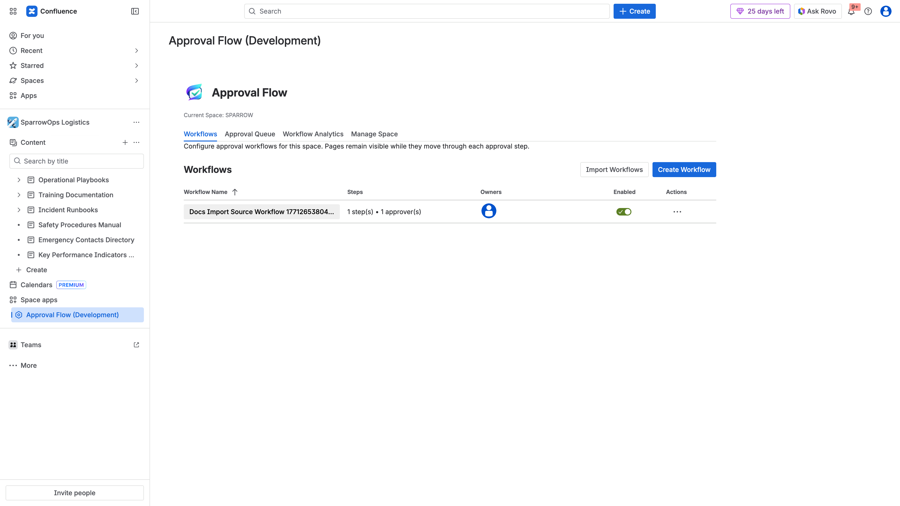

## Preconditions

- Confluence Cloud site with admin access.
- Approval Flow app package deployed and available to install.
- Target space(s): `SPARROW` and optionally `SPARROWSALES`.

## Install Steps

1. Open Confluence as a site or org admin.
2. Go to `Apps` -> `Manage apps`.
3. Install Approval Flow (development or production listing, based on environment).
4. Open target space (for example `SPARROW`).
5. Verify `Approval Flow (Development)` appears under `Space apps` in left navigation.
6. Click `Approval Flow (Development)`.
7. Confirm the app opens with tabs:
   - `Workflows`
   - `Approval Queue`
   - `Workflow Analytics`
   - `Manage Space`

## Verification Screenshot

## Verification Video

- [Admin walkthrough video](../../assets/videos/admin-workflow-management/admin-workflow-management-walkthrough.webm)

## Post-Install Validation Checklist

- App opens without permission errors.
- Workflow table loads.
- Create Workflow button is visible.
- Sidebar entry persists after refresh.
