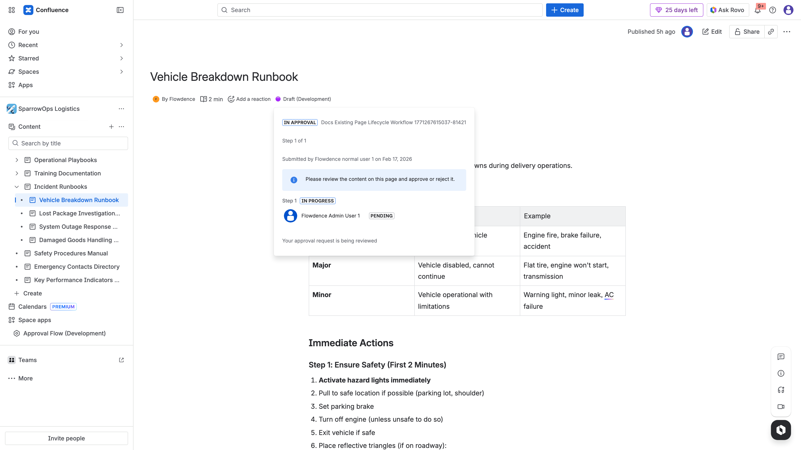

## Objective

Run both decision paths and verify comment/audit behavior.

## Steps

1. Author opens existing page and requests approval.
2. Approver opens pending panel and submits approval comment.
3. Verify approved status.
4. Author submits another page for review.
5. Approver rejects with required-change comment.
6. Verify rejected state and page comments.

## Evidence

### Approve Path

### Reject Path

### Comments/Audit

## Video

- [Lifecycle decision walkthrough](../../assets/videos/approval-lifecycle/approval-lifecycle-walkthrough.webm)
