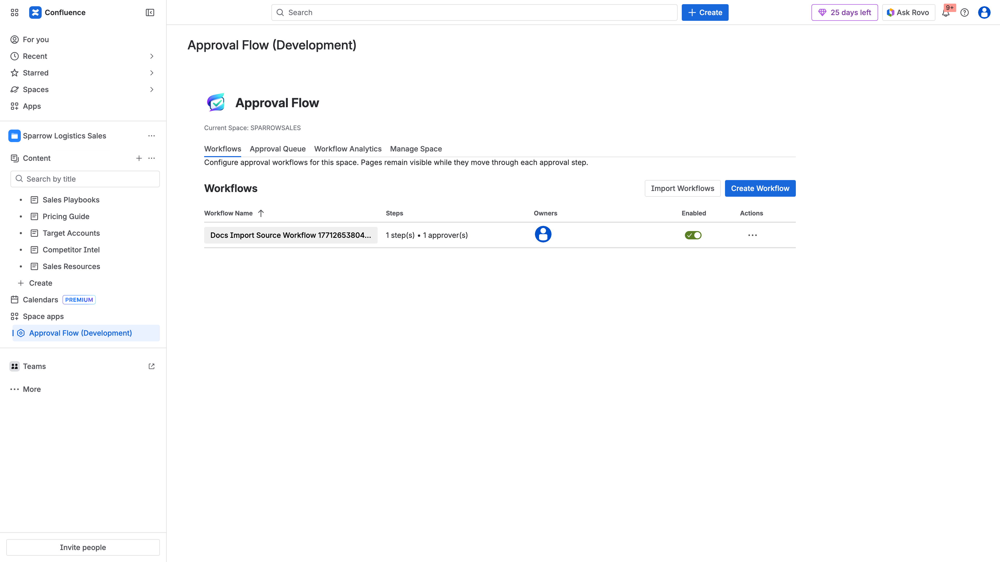
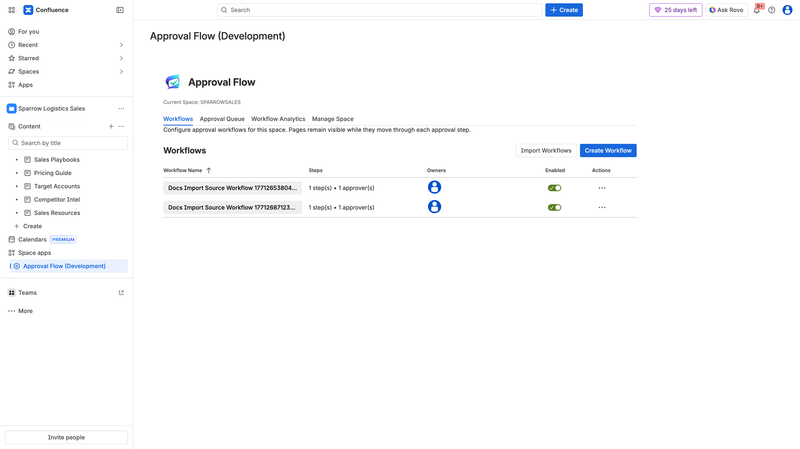

## Objective

Reuse an existing workflow from `SPARROWSALES` in `SPARROW` without rebuilding it manually.

## Steps

1. In `SPARROWSALES`, verify source workflow exists.
2. Switch to `SPARROW` -> `Approval Flow` -> `Workflows`.
3. Click `Import Workflows`.
4. Locate source workflow from SPARROWSALES.
5. Click `Assign`.
6. Verify imported workflow appears in SPARROW table.

## Evidence

- Source space workflow list:

- Source workflow present:

- Import modal in SPARROW:

- Imported workflow visible in SPARROW:

## Video

- [Admin workflow + import walkthrough](../../assets/videos/admin-workflow-management/admin-workflow-management-walkthrough.webm)
