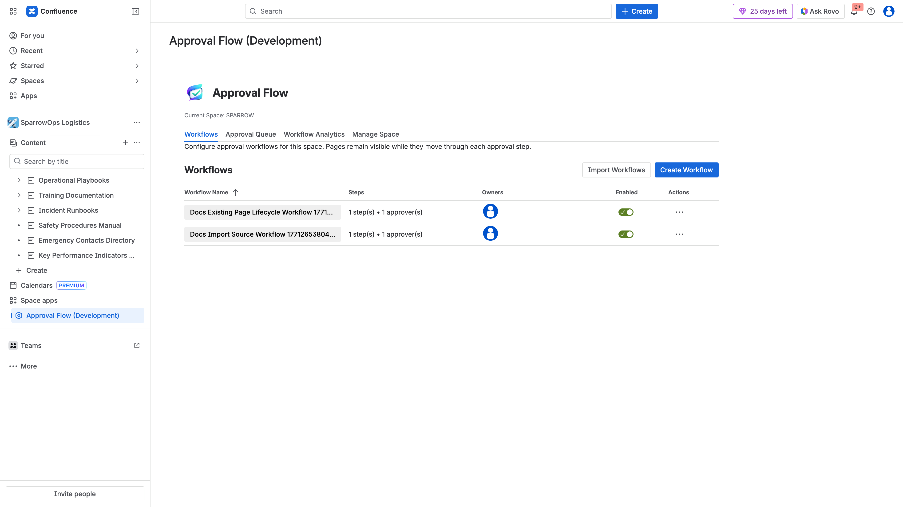
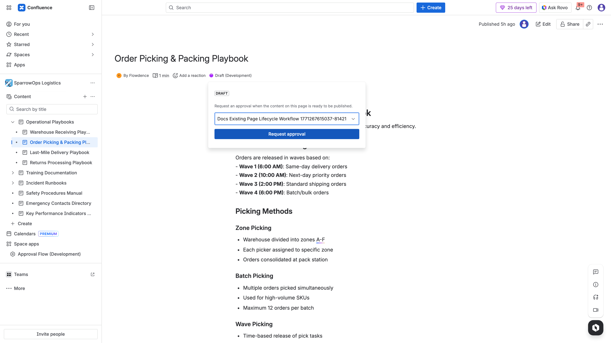
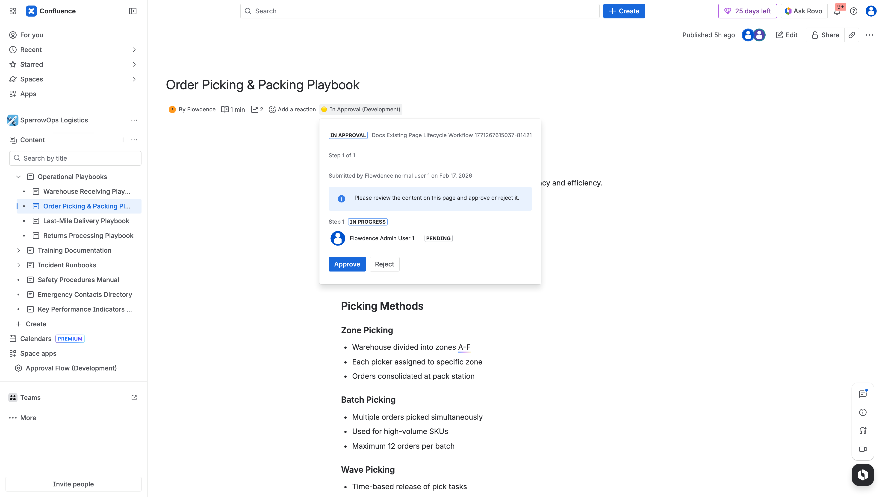
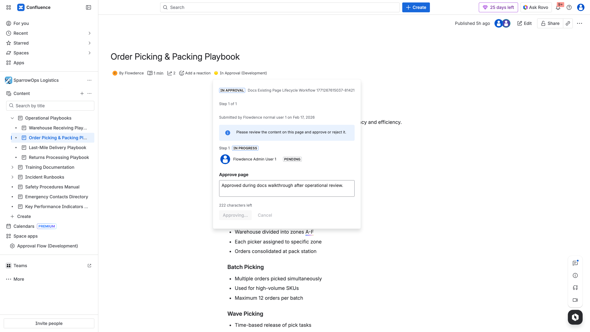
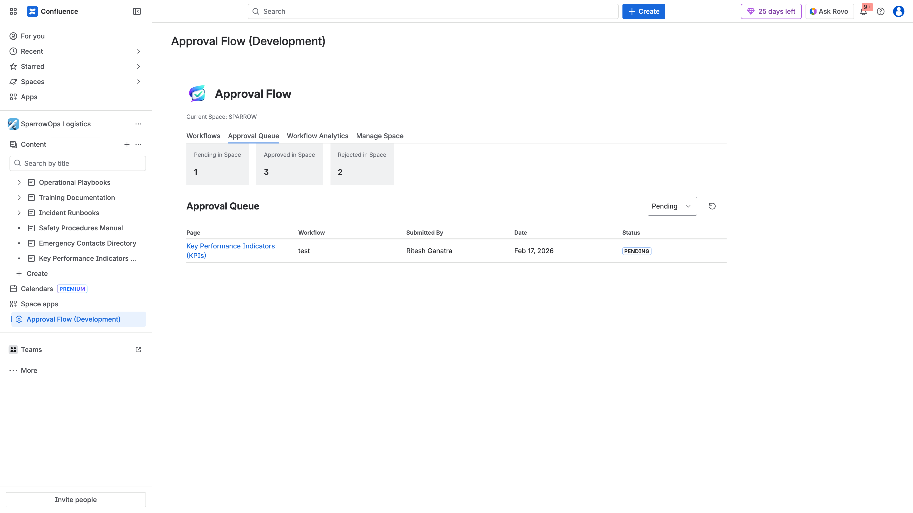

## Objective

Set up a workflow and run first approval cycle using existing SPARROW documentation pages.

## Steps

1. Open `SPARROW` -> `Approval Flow (Development)` -> `Workflows`.
2. Create a workflow and set approver.
3. Open an existing page in SPARROW.
4. Submit for approval from byline.
5. Approver opens page and approves.
6. Verify comments, queue entry, and analytics update.

## Evidence Walkthrough

- Workflow creation:

- Author submission:

- Pending approver view:

- Approved result:

- Queue verification:

- Analytics verification:

## Video

- [Full lifecycle walkthrough](../../assets/videos/approval-lifecycle/approval-lifecycle-walkthrough.webm)
