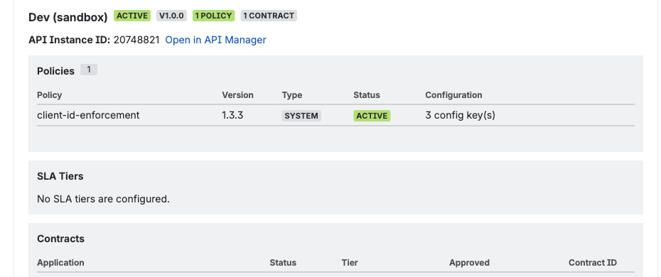

## What This Tab Answers

- Are policies, tiers, and contracts aligned for the same API across environments?
- Which APIs should be prioritized for security standardization?

## Where to Open

`MuleSight Dashboard -> API Security Posture`

## Walkthrough

### Step 1: Locate the API set you care about

Use search/filter controls and `Apply` to narrow to target APIs.

### Step 2: Open API drilldown

Click `View security` on a row to load the detailed modal.

### Step 3: Compare posture sections

Inspect policy table, SLA tiers, and contracts for each environment.

### Step 4: Export findings

Export CSV/HTML when you need shareable evidence outside Confluence.

## Interpretation Tips

- `NOT DEPLOYED` means the API is absent in that environment.
- Configuration summaries on policies help expose false alignment quickly.

## Video

- [Security drilldown and export flow](../../assets/videos/04-dashboard-api-security-modal-and-exports.webm)
