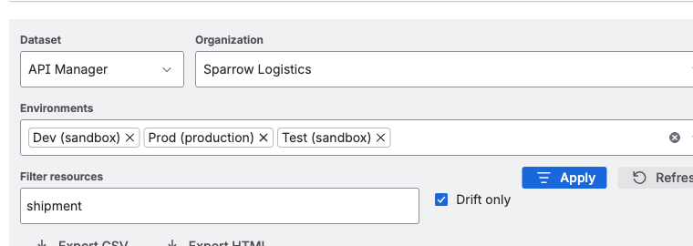

## What This Tab Answers

- Which resources are drifted between environments?
- Which dataset currently has the highest variance?
- Which rows should be exported for release or incident review?

## Where to Open

`MuleSight Dashboard -> Environment Comparison`

## Walkthrough

### Step 1: Set dataset and environment scope

Start with `API Manager`, choose organization and environments, and review baseline row state.

### Step 2: Narrow to actionable drift

Use `Filter resources`, enable `Drift only`, then click `Apply`.

### Step 3: Validate second dataset

Switch to `CloudHub` and repeat the same filter flow.

### Step 4: Export handoff artifacts

Export CSV and HTML from the filtered state for sharing with engineering/release stakeholders.

## How to Interpret a Row

- `DRIFTED`: difference exists in presence, version, or status.
- `NOT DEPLOYED`: logical resource is absent in that environment.
- Hyperlinked ids/names open relevant MuleSoft console destinations.

## Videos

- [Filter, drift-only, refresh, export](../../assets/videos/02-dashboard-env-comparison-filter-refresh-export.webm)
- [Dataset switch: API Manager <-> CloudHub](../../assets/videos/03-dashboard-dataset-switch-cloudhub-to-apimanager.webm)
