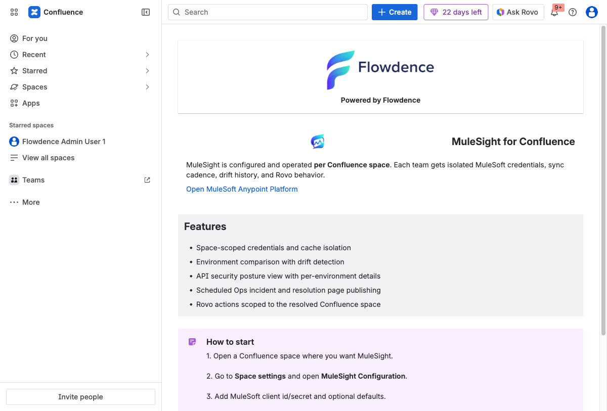
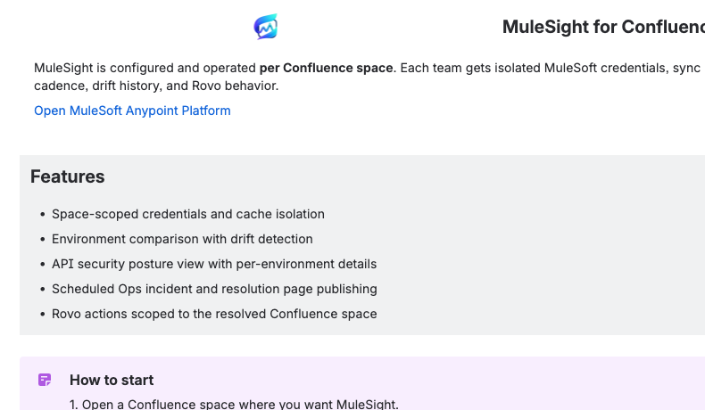

## Purpose

The global landing page introduces MuleSight to first-time users and points them to the correct setup path in each space.

## Where to Open

Open MuleSight from the Confluence apps entry point.

## What New Users Should Do From Here

1. Confirm they are in the correct Confluence site.
2. Move to their target space.
3. Open `Space settings -> Integrations -> MuleSight Configuration`.
4. Complete configuration and validate connection.
