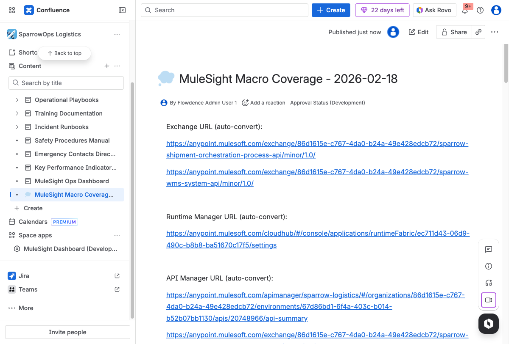
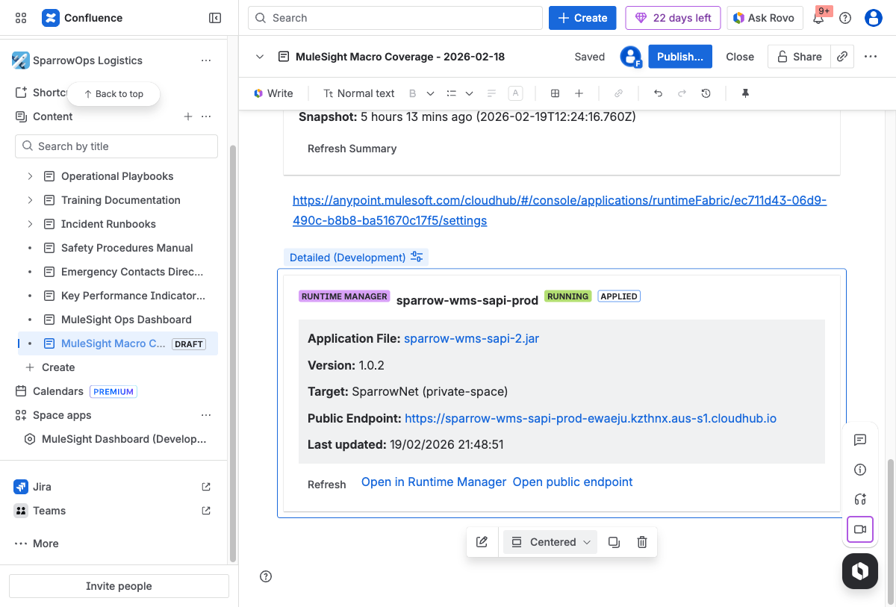
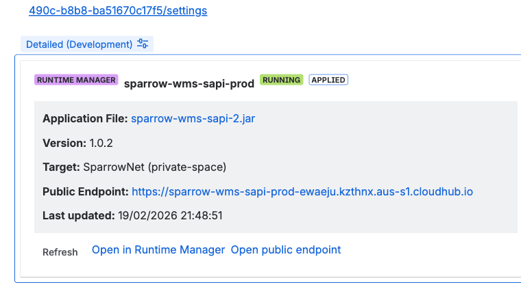
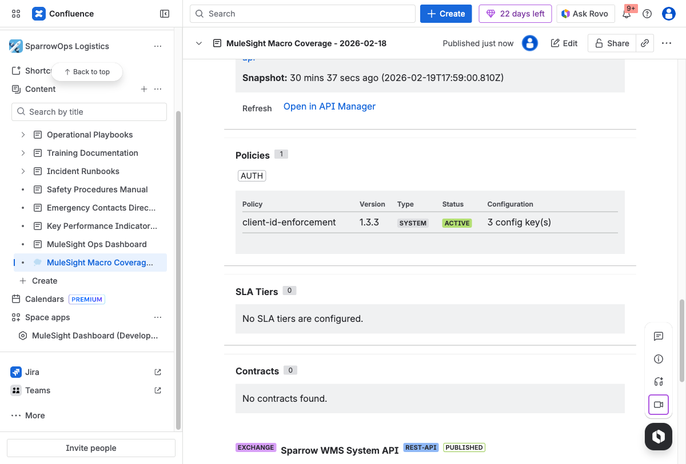
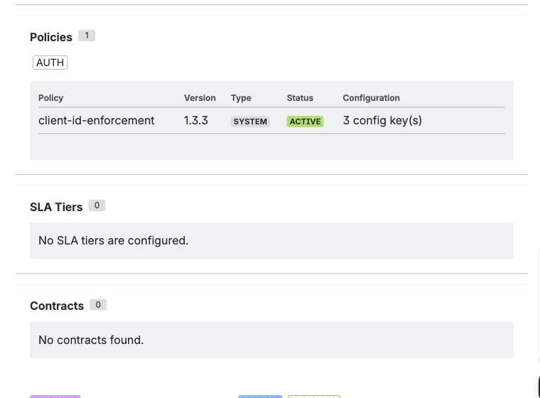
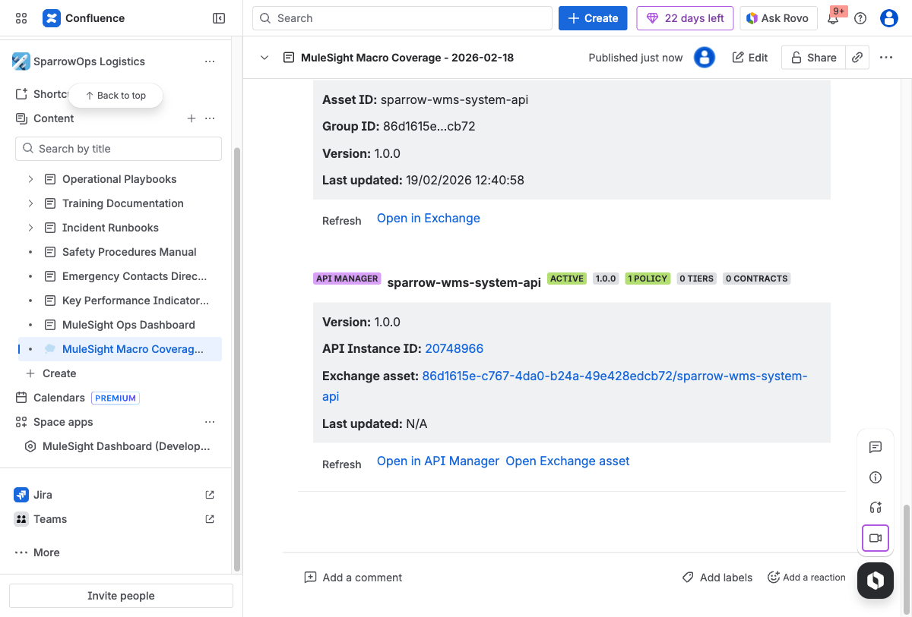
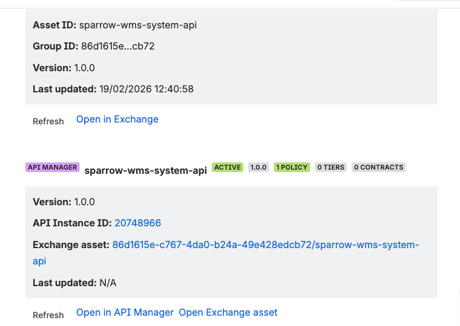
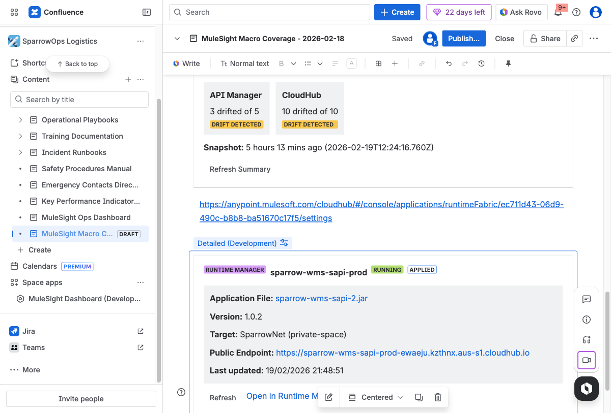
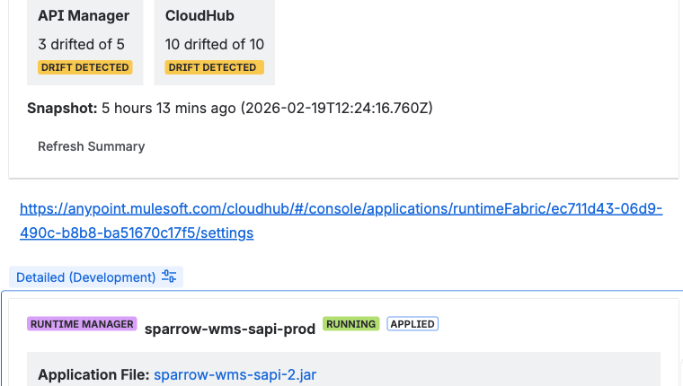

## What You Get

MuleSight converts MuleSoft links into live Confluence cards so architecture and runbook pages stay current without manual screenshots.

## Macro Types

- Exchange asset: `Detailed`, `Compact`
- Runtime Manager application: `Detailed`, `Compact`
- API Manager instance: `Detailed`, `Compact`, `Security`
- Environment Summary: drift summary widget

## Build Your First Macro Page

1. Create a Confluence page.
2. Add one link for each source type (Exchange, Runtime Manager, API Manager).
3. Insert/select macro display modes (Detailed or Compact; Security for API Manager).
4. Add `MuleSoft Environment Summary` macro.
5. Publish and verify snapshot fields and action links.

## Runtime and Compact Views

## API Security View

## API + Exchange Detailed Views

## Environment Summary Widget

## Operational Tips

- Use `Detailed` in design docs and runbooks.
- Use `Compact` for dense status pages.
- Use `Security` view to discuss policy/tier/contract posture with governance teams.
- Use refresh actions before sharing screenshots in incident discussions.
