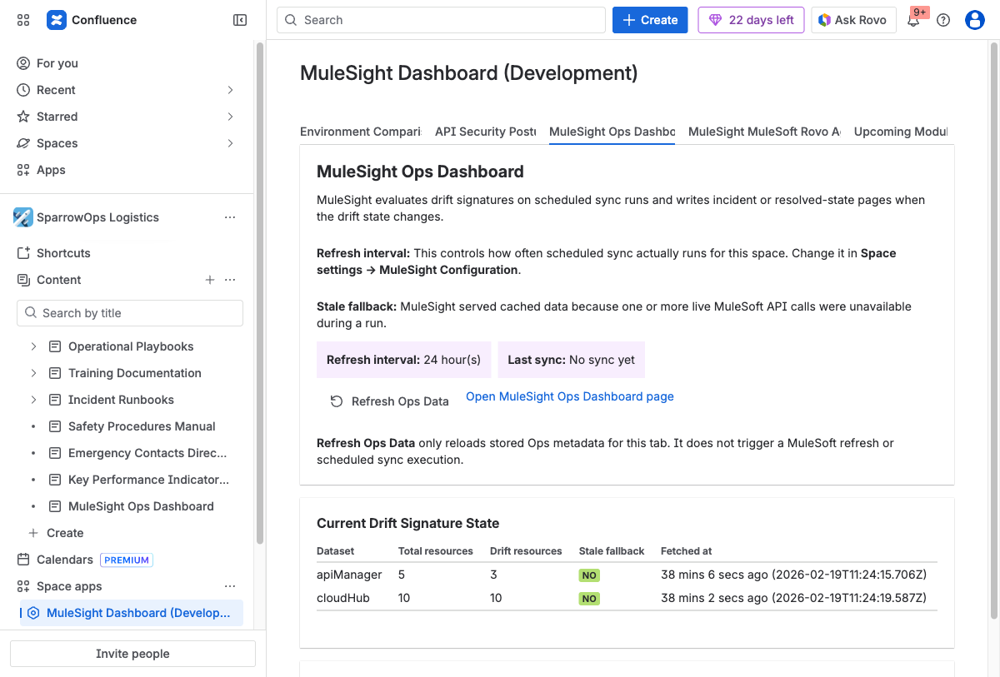
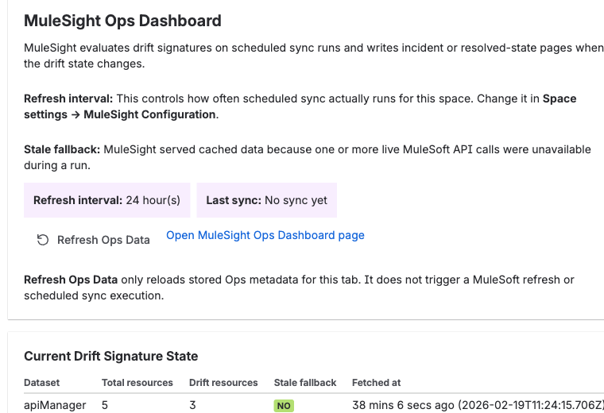
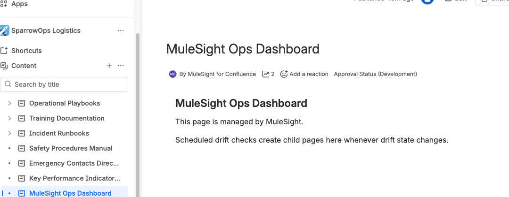
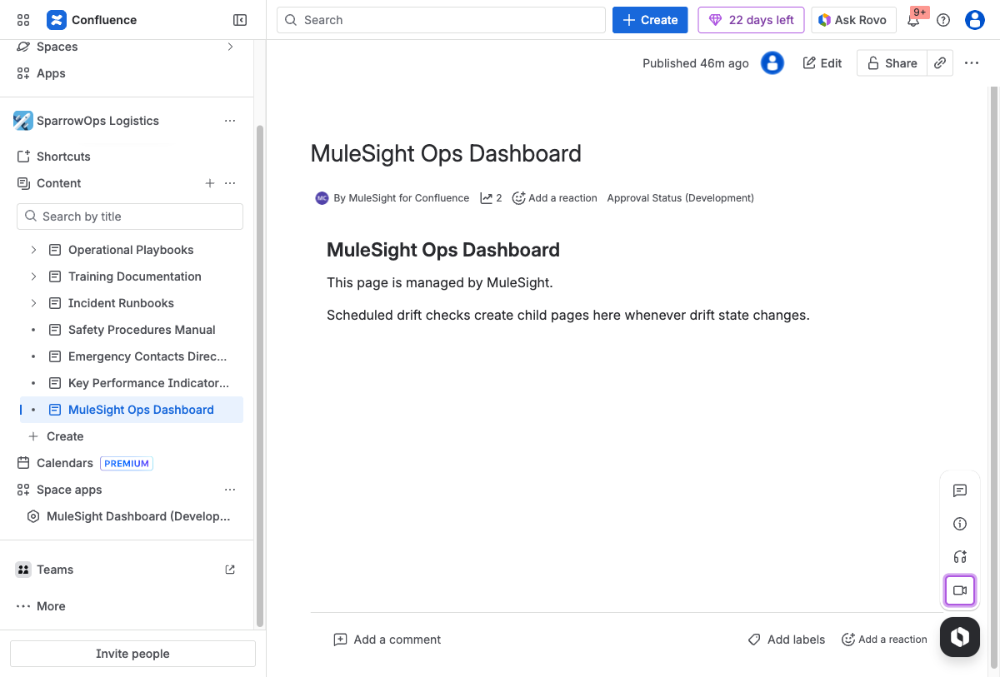

## Why This Tab Matters

This tab provides operational context for drift history publishing and sync health.

## Where to Open

`MuleSight Dashboard -> MuleSight Ops Dashboard`

## Walkthrough

### Step 1: Review operational status fields

Check refresh interval, last sync time, and stale fallback status.

### Step 2: Validate signature summary data

Use the signature table to confirm dataset-level drift and fetch metadata.

### Step 3: Validate published page lineage

Open the linked ops parent page and confirm child drift incident/resolution pages.

## Important Behavioral Rule

`Refresh Ops Data` refreshes tab metadata only. It does not run the scheduler or force a MuleSoft refresh.

## Video

- [Ops tab review and parent page navigation](../../assets/videos/05-ops-tab-refresh-and-parent-page.webm)
