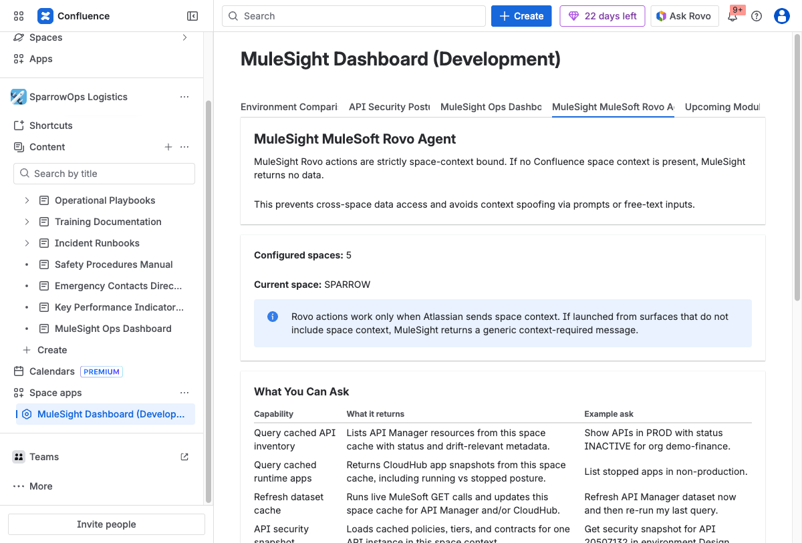
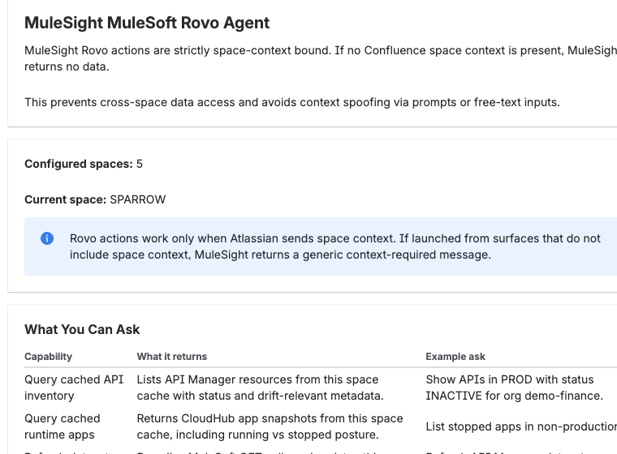

## What It Is

This tab explains how MuleSight Rovo actions work in Confluence and what kinds of questions are supported.

## Key Rule

Rovo actions are space-context bound. If the Confluence surface does not pass space context, MuleSight returns a generic context-required behavior.

## Good Example Questions

- Show APIs in production with status `INACTIVE`.
- List stopped runtime apps in non-production.
- Refresh API Manager dataset cache and re-run the last query.
- Show security posture for a specific API instance id.

## Practical Guidance

- Treat Rovo answers as cache-aware operational guidance.
- Refresh when freshness matters.
- Keep conversations anchored to a known Confluence space context.
