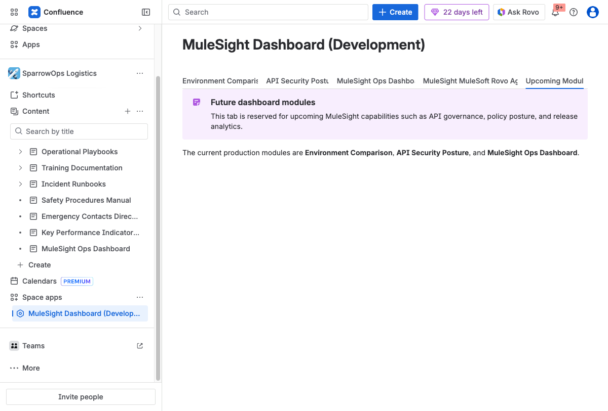
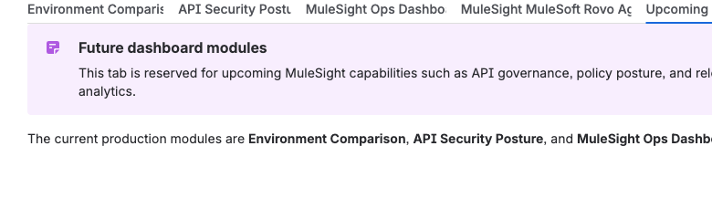

## Purpose

This tab is a roadmap placeholder inside the dashboard. It communicates what module categories are planned next.

## How to Use It Today

- Treat this tab as informational.
- Use Environment Comparison, API Security Posture, and Ops Dashboard for active workflows.
