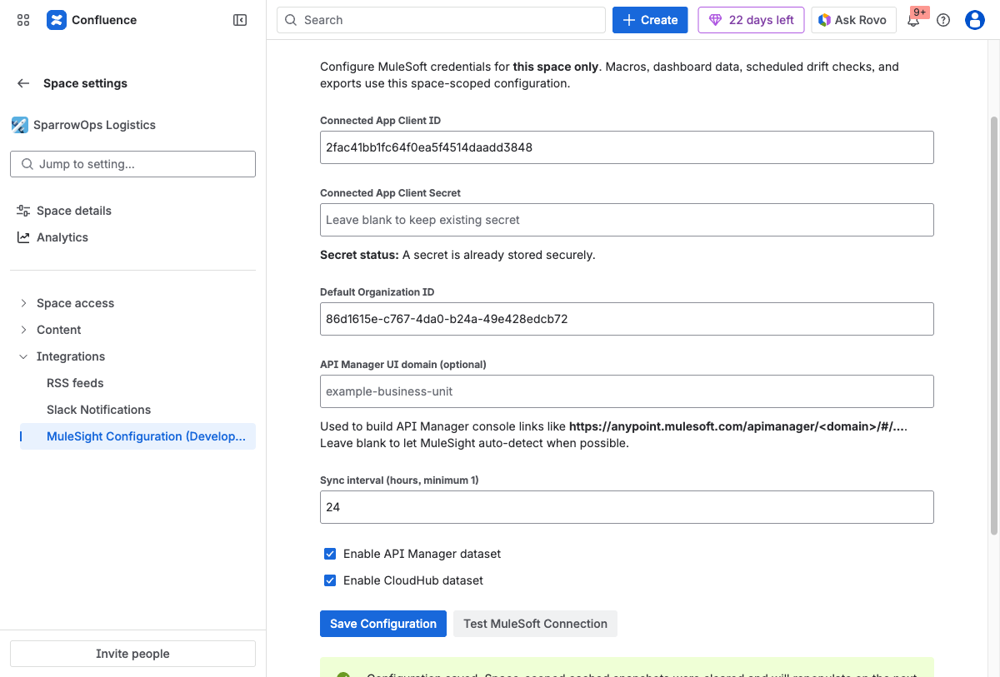

## Outcome

Configure MuleSight for one space and validate connectivity before users rely on dashboard or macro data.

## Where to Configure

Open `Space settings -> Integrations -> MuleSight Configuration`.

## Field Guide

| Field | Why it matters |
| --- | --- |
| Connected App Client ID | Identifies the MuleSoft connected app MuleSight uses. |
| Connected App Client Secret | Authenticates MuleSight against MuleSoft APIs. |
| Default Organization ID | Sets org context for dashboard and macro fetches. |
| API Manager UI domain (optional) | Stabilizes generated API Manager console links in edge cases. |
| Sync interval (hours) | Controls scheduled sync cadence for this space. |
| Dataset toggles | Enables/disables API Manager and CloudHub collection per space. |

## Walkthrough

### Step 1: Enter configuration values

Fill client id, client secret, and default organization id. Keep both dataset toggles enabled unless you intentionally need partial data.

### Step 2: Save configuration

Click `Save Configuration` and confirm the form remains populated.

### Step 3: Test the MuleSoft connection

Click `Test MuleSoft Connection` and verify success details.

### Step 4: Validate dashboard data

Open MuleSight Dashboard and confirm data rows load for selected environments.

## Common Setup Mistakes

- Saving credentials but skipping connection test.
- Using an incorrect org id and interpreting missing data as an app issue.
- Disabling a dataset and expecting both datasets in dashboard views.

## Video Walkthrough

- [Configure, save, and test](../../assets/videos/01-space-configuration-save-and-test.webm)
