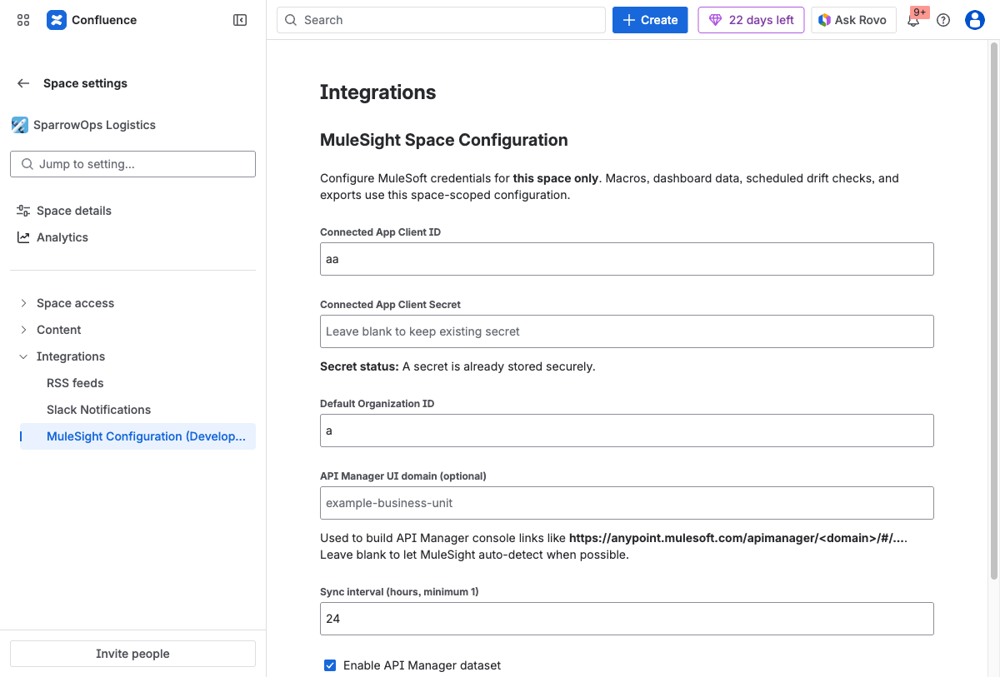

## Outcome

By the end of this page, you will have confirmed MuleSight is installed and reachable from the three entry points new users care about.

## Prerequisites

- MuleSight is installed on your Confluence site.
- You have space admin permissions in the target space.

## Walkthrough

### Step 1: Confirm the global app entry

Open MuleSight from Confluence apps and verify the landing page loads.

### Step 2: Confirm the space dashboard entry

Open MuleSight Dashboard in your target space and ensure the dashboard tabs render.

### Step 3: Confirm the space settings entry

Open `Space settings -> Integrations` and verify `MuleSight Configuration` is listed.

## Installation Is Healthy When

- Global landing page loads without app errors.
- Dashboard tabs render in the space page.
- Space configuration entry is visible under Integrations.
