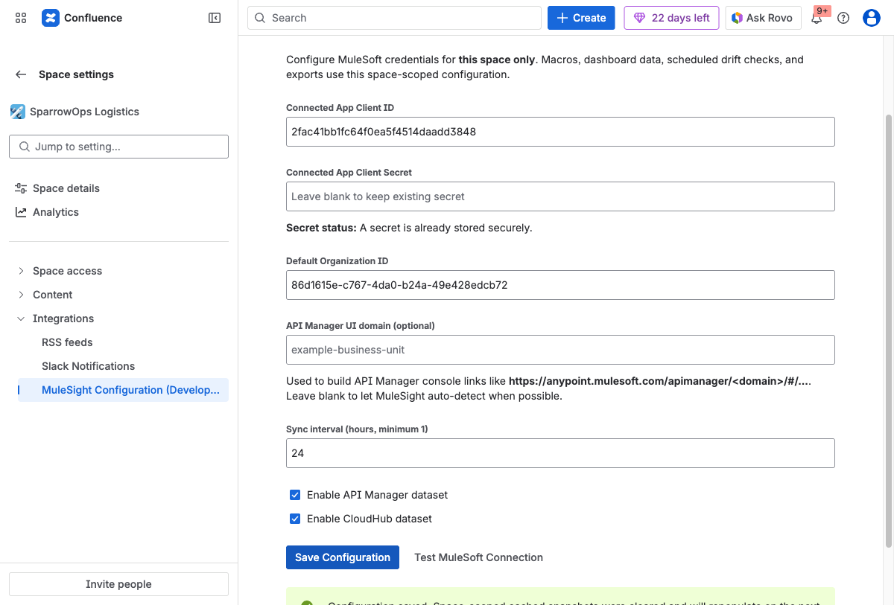
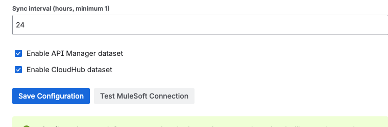
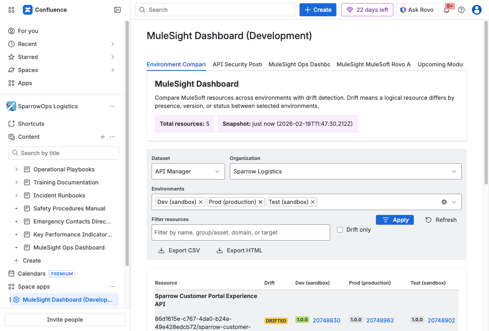

## Scenario

You are enabling MuleSight in a space for the first time and need confidence that it is production-ready for daily use.

## Time Estimate

10-15 minutes

## Guided Flow

### Step 1: Open configuration

Go to `Space settings -> Integrations -> MuleSight Configuration`.

### Step 2: Enter credentials and save

Fill MuleSoft connected app values and default organization id, then save.

### Step 3: Test connection

Run `Test MuleSoft Connection` and confirm success details are present.

### Step 4: Confirm dashboard data

Open MuleSight Dashboard and verify rows load in Environment Comparison.

## Success Checklist

- Connection test shows success.
- Organization and environment count are populated.
- Environment Comparison contains real data rows.

## Video

- [Configuration and connection test](../../assets/videos/01-space-configuration-save-and-test.webm)
