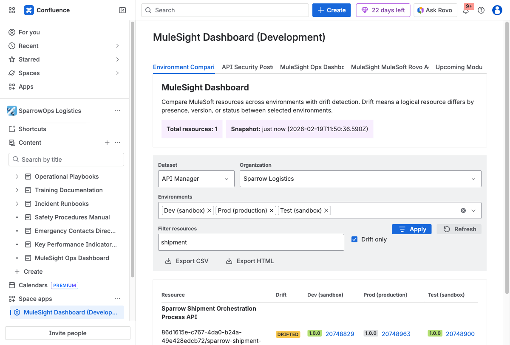
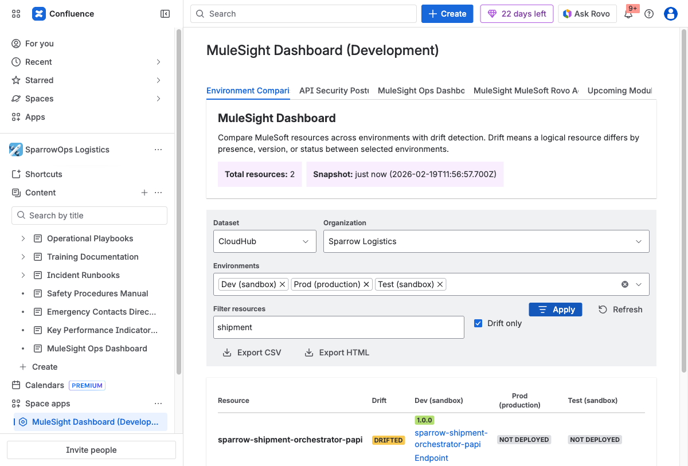
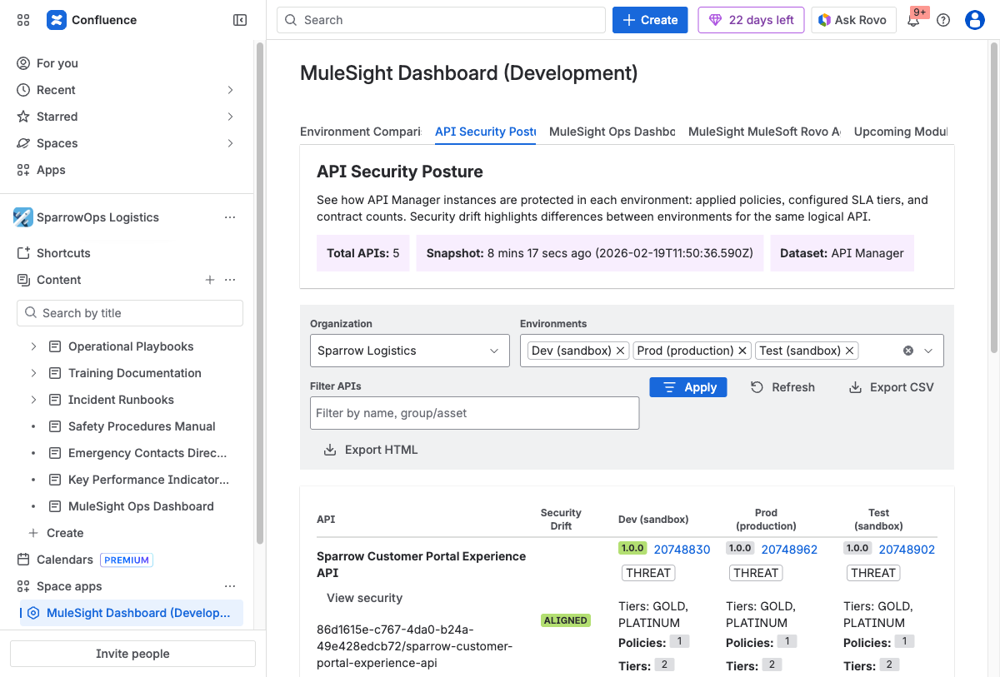
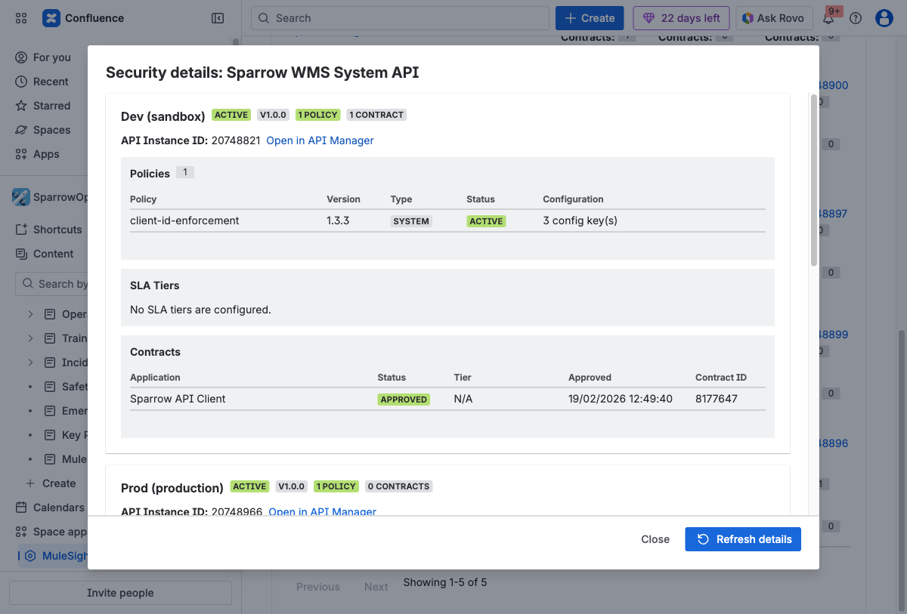

## Scenario

A release owner asks: "What drift exists now, and what security differences should we fix first?"

## Time Estimate

10 minutes

## Guided Flow

### Step 1: Filter for drift in Environment Comparison

Select dataset and environments, enable `Drift only`, then apply.

### Step 2: Repeat on the second dataset

Switch to `CloudHub` and verify whether drift pattern is similar or different.

### Step 3: Drill into security posture

Open `API Security Posture`, then use `View security` on key APIs.

### Step 4: Capture ops context

Open `MuleSight Ops Dashboard` to capture sync/ops status alongside drift findings.

### Step 5: Export and share

Export CSV/HTML and share with release and governance stakeholders.

## Deliverables You Should Share

- CSV export for row-level drift evidence.
- HTML export for broad review.
- Security modal screenshot for API-level posture context.

## Videos

- [Environment comparison filtering and export](../../assets/videos/02-dashboard-env-comparison-filter-refresh-export.webm)
- [Dataset switching workflow](../../assets/videos/03-dashboard-dataset-switch-cloudhub-to-apimanager.webm)
- [Security modal and export workflow](../../assets/videos/04-dashboard-api-security-modal-and-exports.webm)
- [Ops context walkthrough](../../assets/videos/05-ops-tab-refresh-and-parent-page.webm)
